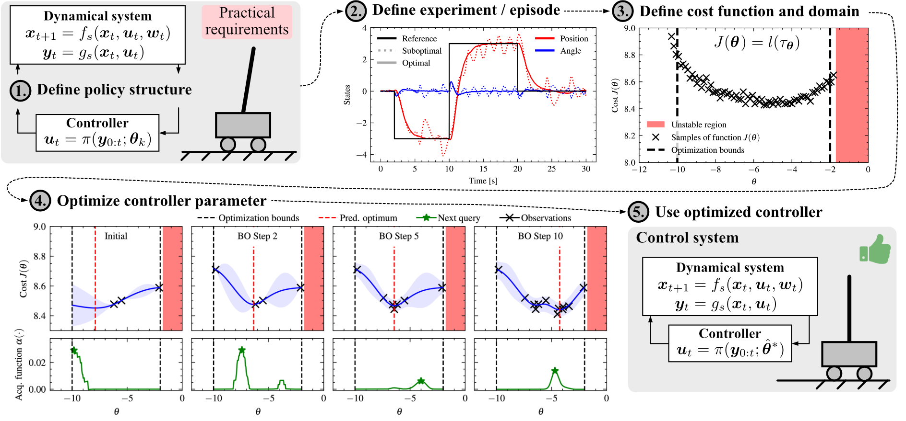
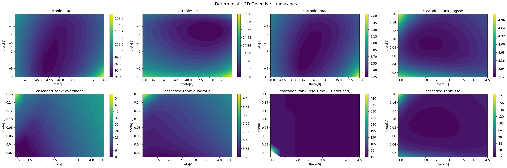

# TuneControl

A collection of **black-box controller-tuning problems** with a common
Python interface. Choose a problem and objective, supply controller gains, and
receive a scalar cost plus the simulated trajectory.

The collection currently includes CartPole and cascaded tanks, each with several
objectives and deterministic or noisy configurations. You can use the problems
with your own optimizer or add a new problem family.



## Install

TuneControl currently supports **Python 3.12**. Install from GitHub:

```bash
python -m pip install "tunecontrol @ git+https://github.com/Data-Science-in-Mechanical-Engineering/tunecontrol.git"
```

For the Bayesian optimization notebook, include BoTorch:

```bash
python -m pip install "tunecontrol[botorch] @ git+https://github.com/Data-Science-in-Mechanical-Engineering/tunecontrol.git"
```

For development from a local checkout, run `python -m pip install -e '.[dev,botorch]'`.

## Evaluate a controller

```python
from tunecontrol import CartPole, CartPoleConfig

problem = CartPole(CartPoleConfig(dim=2, objective="mae"))
theta = problem.bounds.mean(dim=0)
value, info = problem.evaluate(theta)

print(f"Cost: {value.item():.4f}")
print("Controller:", theta.tolist())
print("State columns:", info["trajectory"]["state_names"])
```

Expected output:

```text
Cost: 8.2734
Controller: [-40.0, -6.25]
State columns: ('cart_position', 'cart_velocity', 'pole_angle', 'pole_angular_velocity')
```

The bounds describe the controller search space; their midpoint is an example
controller. `info["trajectory"]` contains timestamps, state and input arrays,
and column names and units. See [evaluate and plot](examples/quickstart.py) to
visualize both built-in problems.

## Problems

| Family | Controller parameters | Objectives | Standard configurations |
|---|---|---|---|
| [CartPole](docs/cartpole_task_doc.md) | 1–4 state-feedback gains | MAE, LQR, ITAE | 24 |
| [Cascaded tanks](docs/cascaded_tank_task_doc.md) | 2 PI gains | SSE, LogSSE, quadratic, rise time, overshoot | 10 |

Both families provide deterministic and noisy configurations. Standard
configurations enumerate combinations of dimensions, objectives, and noise;
custom settings are also supported. The linked problem descriptions define the
models, objectives, bounds, and sampling conventions.

```python
import tunecontrol as tc

print(tc.list_problems())  # ['cartpole', 'cascaded_tank']
configs = tc.available_configs("cartpole")
problem = tc.make("cartpole", config={"dim": 2, "objective": "mae"})
```

Direct Python construction and registry construction use the same configurations.
See [discover and configure](examples/discover_problems.py) for configuration
serialization and reconstruction.



Darker colors indicate lower cost. White regions mark undefined evaluations.

## Noise and evaluation behavior

Configurations are deterministic by default (`noise=None`). To add process noise
and CartPole initial-state perturbations, supply a noise configuration:

```python
from tunecontrol import CartPole, CartPoleConfig, CartPoleNoise

problem = CartPole(CartPoleConfig(dim=2, noise=CartPoleNoise()))
problem.setup(run_seed=42)
value, info = problem.evaluate(problem.bounds.mean(dim=0))
```

Each problem owns its random stream. Successive noisy evaluations advance that
stream; calling `setup(run_seed=42)` again replays the sequence. Record the family,
full configuration, package version, and seed when saving an experiment. Seeded
replay assumes the same software and runtime environment.

`evaluate` accepts a finite floating-point tensor of shape `(problem.dim,)`.
Gains must lie within the declared bounds, including the endpoints. Out-of-bounds
gains raise `ValueError` before simulation. Other invalid inputs also raise errors.
Undefined or nonfinite objectives return `(NaN, info)` with diagnostics preserved.
Check `torch.isnan(value)` before using a cost in an optimizer. Penalty handling
belongs to the optimizer or example, rather than the problem itself.

## Examples

Start with [the example guide](examples/README.md). Notebooks include saved outputs
and plots so you can read them directly on GitHub.

| Example | Purpose |
|---|---|
| [Evaluate and plot](examples/quickstart.py) | Run both built-in problems and inspect trajectories |
| [Discover and configure](examples/discover_problems.py) | List families and save a configuration |
| [Bayesian optimization](examples/standard_bo_for_controller_tuning.ipynb) | Tune one controller gain with BoTorch |
| [Add a problem](examples/creating_custom_task.ipynb) | Implement a mass-spring-damper family |

## Contributing

New controller-tuning problems are welcome. Start with the
[custom-task notebook](examples/creating_custom_task.ipynb) and the
[family API and contribution guide](docs/task_module_architecture.md).
Document the model, controller parameters, objective definitions, noise, and
sampling, and include tests and an example trajectory with your contribution.

## Citation
TuneControl was introduced in [*A Decade of Bayesian Optimization for Controller Tuning and Robot Learning: Tutorial, Review, and Future Prospects*](https://arxiv.org/abs/2609.09403). Please cite it if TuneControl supports your research.

```bibtex
@misc{stenger2026decade,
    title = {A Decade of {Bayesian} Optimization for Controller Tuning and Robot Learning: Tutorial, Review, and Future Prospects},
    author = {Stenger, David and Brunzema, Paul and Menn, Johanna and von Rohr, Alexander and Schoellig, Angela P. and Trimpe, Sebastian},
    year = {2026},
    eprint = {2609.09403},
    archivePrefix = {arXiv},
    primaryClass = {cs.RO},
    doi = {10.48550/arXiv.2609.09403},
    url = {https://arxiv.org/abs/2609.09403}
}
```

## License
Released under the [MIT License](LICENCE.txt).
